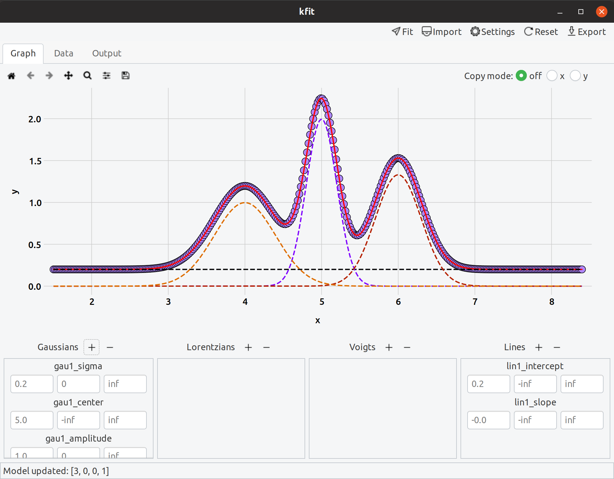

<h1>kfit - Simple, graphical spectral fitting</h1>

kfit is a tool for quick and easy spectral fitting in science and education.
It works as a standalone data fitting program for simple tasks, or as an
exploratory tool in more complex projects. kfit provides a few commonly 
used peak shapes in engineering and physics, and will eventually support 
custom models.
  

## Installation

### The easy way

`sudo snap install kfit`

### From source

#### Dependencies

From pip/conda...

- lmfit
- matplotlib
- pandas
- numpy

From apt or similar...

- python3-gi
- python3-gi-cairo
- gir1.2-gtk-3.0

## Contributing

- Check out [NOTES.md](./NOTES.md) for development notes and outstanding issues

